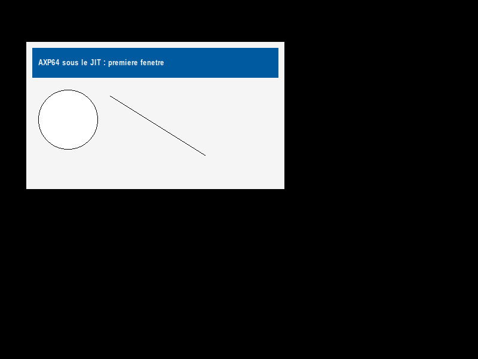

# Test Windows DEC Alpha program

Run Windows **AXP64** binaries — 64-bit DEC Alpha, the architecture of the
Windows 2000 betas — on an ordinary x86-64 Linux box, under **unmodified
Wine**.



Windows on Alpha is usually remembered as 32-bit only. It was not: the
Windows 2000 beta shipped a 64-bit Alpha target, and PE files for it carry
machine type `0x0284` with a PE32+ optional header. Those binaries have had
nowhere to run for twenty-five years — there is no Alpha-PE toolchain left
(LLVM dropped its Alpha backend in 3.0, binutils has no `alpha-pe` target)
and no emulator that pairs an Alpha CPU with a Win32 personality.

This repository is that pairing.

## How it works

The model is Wine's own PE/Unix split, moved down one level:

```
  AXP64 application            DEC Alpha code   ─┐
  AXP64 KERNEL32/USER32/GDI32/MSVCRT/…          │  everything here is Alpha,
  (thin forwarders, compiled to Alpha)          │  translated by the JIT
                                               ─┘
  ── one boundary ───────────────────────────────
  winhost.exe                  x86-64 Windows PE, runs under stock Wine
  Wine                         unmodified
```

Only `winhost.exe` is native. Everything above it — the application *and*
the Win32 layer it calls — is DEC Alpha machine code, translated to x86-64 a
basic block at a time.

Two mechanisms carry the boundary, and nothing else:

* **guest → host** — opcode 0 is unused by user-mode Alpha code, so it is
  reused as a call gate. An import thunk executes one such instruction and
  the host runs the native routine.
* **host → guest** — guest memory is mapped **read/write but not
  executable**. When Wine calls back into a guest address (a window
  procedure, a sort callback, a self-drawing control) the page faults, a
  vectored exception handler catches it, marshals the x64 argument registers
  into the Alpha ones and runs the block through the translator.

Guest memory is mapped at its true addresses, so a guest load or store is a
plain x86-64 memory access with no address translation at all.

### The translator

A basic-block JIT, not an interpreter. Alpha SIMD becomes x86 SIMD rather
than a call into C:

| Alpha | x86-64 |
|---|---|
| `PERR` | `psadbw` |
| `MINUB8` / `MAXUB8`, `MINSW4` / `MAXSW4` | `pminub` / `pmaxub`, `pminsw` / `pmaxsw` |
| `MINSB8` / `MAXSB8`, `MINUW4` / `MAXUW4` | SSE4.1 `pminsb` / `pmaxsb` / `pminuw` / `pmaxuw` (SSE2 fallback) |
| `UNPKBW`, `PKWB` | `punpcklbw`, `pand` + `packuswb` |
| `CMPBGE` | `pmaxub` + `pcmpeqb` + `pmovmskb` |
| `ADDT` / `SUBT` / `MULT` / `DIVT` / `SQRTT` | `addsd` / `subsd` / `mulsd` / `divsd` / `sqrtsd` |
| `CMPTxx` | `cmpsd` with the matching predicate |
| `CVTTQ` | `cvtsd2si`, MXCSR carrying the Alpha rounding qualifier |

The Alpha rounding mode (`/C`, `/M`, `/D` from `FPCR<59:58>`) is programmed
into MXCSR, reloaded only when it actually changes inside a block, and the
host's own MXCSR is restored before every exit and every call out — Wine
must never see it. NaN selection follows the Alpha rule exactly, including
the x87-style tie-break when *both* operands are NaN.

Measured against the previous C-helper implementation, same results bit for
bit: **×9.4** on a floating-point kernel, **×12.3** on a multimedia kernel.

## Build

Needs `gcc`, `x86_64-w64-mingw32-gcc`, `alpha-linux-gnu-gcc` + `binutils`,
`python3`, and `wine` to run.

```sh
sudo apt install gcc-mingw-w64-x86-64 gcc-alpha-linux-gnu binutils-alpha-linux-gnu wine python3
make            # host loader, translator, and the AXP64 guest side
make run        # the demo: a real window, drawn by Alpha code
```

`make run` starts an Xvfb if `$DISPLAY` is unset, so it works headless.

To run something else built for Windows AXP64:

```sh
./run.sh path/to/other.exe
```

## Validation

The translator is checked against `qemu-alpha -cpu ev67`: the same
instruction sequence runs under both, then all 32 integer registers, all 32
floating-point registers, the FPCR and 4 KiB of memory are compared byte for
byte.

```sh
make test
```

1000 random sequences of 48 instructions across ten classes — integer,
memory, branches, floating point, rounding-qualified forms, the EV6
multimedia extension, `LDS`/`STS`, `ITOF`/`FTOI`/`FCMOV` — pass with zero
mismatches, plus 110 hand-built NaN corner cases.

The campaign found genuine bugs, including: `CVTST/S` encodes with trap mode
**6**, not 2, so the discriminator against `CVTTS` is `(trap & 3) == 2`;
the S→T expansion of a denormal keeps the mantissa with a zero exponent
rather than collapsing to a signed zero; and with two NaN operands Alpha
does not keep the first the way x86 does.

## Is this a real port, or a wrapper?

The AXP64 side is genuinely Alpha: the guest executes Alpha instructions,
translated to x86-64, and the Win32 layer above Wine is itself compiled to
Alpha. But *running* Alpha instructions is not the same as honouring the
Windows Alpha **calling convention**, which is a separate document from the
SysV Alpha ABI that `alpha-linux-gnu-gcc` targets.

That difference is measured, not assumed, in
**[ABI.md](https://github.com/ytrezq/dec-alpha-cross-binutils/blob/main/ABI.md)**:
which registers the two conventions agree on (argument, return, callee-saved,
varargs — all of them), which they do not (`gp`, the procedure-value
register), and what is still missing (`.pdata`, so no SEH). It includes a
controlled experiment isolating the one register that differs, and it states
where a single test application stops proving things.

## Prebuilt

If you would rather not install a cross toolchain, [`prebuilt/axp64-runtime-prebuilt.zip`](prebuilt/) is the compiled
output of this repository: the JIT, the Wine-hosted loader, the Alpha-compiled Win32
layer, and an AXP64 test application built from source here.

## What is in here

| | |
|---|---|
| `src/jit.c`, `src/x86emit.h` | the Alpha → x86-64 translator and its emitter |
| `src/helpers.c` | the C fallback for encodings the translator does not take |
| `src/winhost.c` | the loader: PE loading, the call gate, the NX-fault path, the native side of the Win32 layer |
| `win32/` | the AXP64 Win32 layer — `KERNEL32`, `USER32`, `GDI32`, `MSVCRT`, `ADVAPI32`, `SHELL32`, `COMDLG32`, `COMCTL32` — all compiled to Alpha |
| `toolchain/` | a copy of the AXP64 cross toolchain (canonical home below) |
| `tests/difftest.py` | the differential test against qemu-alpha |

## Related

* **[dec-alpha-cross-binutils](https://github.com/ytrezq/dec-alpha-cross-binutils)** —
  how these PE files are produced at all: an ELF → PE32+ converter on top of
  stock `alpha-linux-gnu` binutils.
* **[dec-alpha-mfc42-partial-reverse-engineering](https://github.com/ytrezq/dec-alpha-mfc42-partial-reverse-engineering)** —
  a reimplementation of `MFC42.DLL` for AXP64, which is what it takes to run
  a real MFC application such as Dependency Walker.

## Provenance and licensing

The Win32 layer in `win32/` — `KERNEL32`, `USER32`, `GDI32`, `MSVCRT`,
`ADVAPI32`, `SHELL32`, `COMDLG32`, `COMCTL32` — is original code written
against the published Win32 API, in the same clean-room position as Wine: no
Microsoft source, no leaked source, no disassembly of Microsoft's
implementation. It is covered by this repository's licence and is meant to be
redistributed, including in binary form. `prebuilt/` exists for exactly that.

This is why the amd64 comparison in `docs/` needed nothing compiled at all:
Wine's own reimplementation of the same API is packaged by the distribution,
so `depends.exe` for amd64 runs on stock `apt install wine`. This repository
is the AXP64 half of that same idea — the API reimplemented, this time for an
architecture Wine has no port for.

The one component with a different provenance is `MFC42`, which lives in
[its own repository](https://github.com/ytrezq/dec-alpha-mfc42-partial-reverse-engineering):
MFC 4.2 exports by ordinal with no public mapping, so ordinals, vtable slot
order and structure offsets had to be recovered by analysing Microsoft's
shipped binary and its public PDB. That is reverse engineering for
interoperability — the same thing Wine does for undocumented interfaces — and
it is still original code, but the distinction is worth stating plainly.

No Microsoft binary is redistributed anywhere in these repositories. The
AXP64 test program is built from source here; to run a real AXP64 application
you supply your own copy of it.
